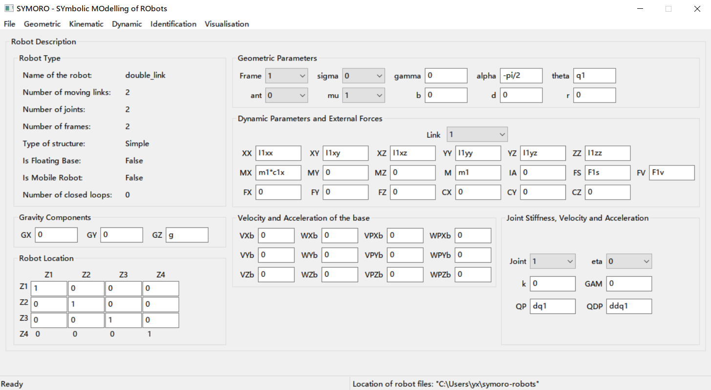

SYMORO
======

SYOMRO is a software package for SYmbolic MOdeling of RObots.

This software package is developed as part of the OpenSYMORO project by
the robotics team at [IRCCyN][lk:irccyn] under the supervision of Wisama
Khalil.

For details on the algorithms used, please see [the paper][lk:hal]
published in the AIM 2014 conference.

**Note that I have made some modifications based on the great work by [vijaravind](https://github.com/symoro/symoro), [galou](https://github.com/galou/symoro) and [cmigliorini](https://github.com/cmigliorini/symoro/tree/python3).**




Requirements (tested with Win10 and anaconda successfully)
------------
+ python (==3.8.13)
+ sympy (== 0.7.3)
+ numpy (>= 1.6.1)
+ wxPython (>= 2.8.12)
+ PyOpenGL (>= 3.0.1b2)


Setup
---------------
```bash
pip uninstall symoro -y
git clone https://github.com/xu-yang16/symoro-python3.git
cd symoro-python3
python setup.py develop
python bin/symoro-bin.py
```


Getting Started
---------------
* [A simple introduction in Chinese](https://www.zhihu.com/collection/825441151)
* The paper [SYMORO+: A SYSTEM FOR THE SYMBOLIC MODELLING OF ROBOTS](https://hal.archives-ouvertes.fr/hal-00401687/document)
* The book [Modeling Identification and Control of Robots](http://home.elka.pw.edu.pl/~ptrojane/books/Modeling,%20Identification%20and%20Control%20of%20Robots.pdf)
* A few notes by me:
  * **Attention**: the box `MX`, `MY` and `MZ` should be something like $m_1c_{1x}, m_1c_{1y}$ and $m_1c_{1z}$ instead of the postion of CoM.
  * **Kinematic - Jacobian matrix**: the generated file includes the Jacobian matrix $J$ and the position vector connecting the origin of frame i to that of frame j $L$.
  * **Dynamic - Inverse Dynamic Model**: the generate file is in the following form
    $$
      \Gamma = A\begin{bmatrix}
          \ddot q_{active}\\
          \ddot q_{passive}
      \end{bmatrix}+H.
    $$
    where $H$ is the vector of the centrifugal, Coriolis and gravity torques. (Note that the matrix $A$ and $H$ can be respectively generated by `Inertia matrix` and `Centrifugal, Coriolis and gravity torques`).
  * **Dynamic - Direct dynamic model**: the generated file is in the following form based on the recursive Newton-Euler equations:
    $$
      \ddot q=A^{-1}[\Gamma - H(q, \dot q)]
    $$
  * **Identification - base inertia paramters**: generate a table of the minimum set of the dynamic inertia parameters. Note that the base paramters should also include the joint friction parameters $Fs$ and $Fv$.
  * **Identification - Dynamic Identification model**: I usually run `base inertia paramters` to generate a new model with the base paramters (the file ended with `_base`). Then, load the new model and run `Dynamic Identification model` to generate the coefficient matrix $D(q,\dot q, \ddot q)$, where $\Gamma=D(q, \dot q, \ddot q)K$ and $K$ is the base parameter vector. Note that the elements of $D$ begin their name with $DG$, for example, $DG2F2s = sign(dq2), DG2F2v = dq2$.

Licence
-------
See [LICENCE][lk:licence].


Contributors
------------
See [Contributors][lk:contributors].


[lk:irccyn]: http://www.irccyn.ec-nantes.fr/
[lk:hal]: http://hal.archives-ouvertes.fr/hal-01025919
[lk:setup]: https://github.com/symoro/symoro/wiki/Setup
[el:aravind]: mailto:aravind.v@tum-create.edu.sg
[lk:licence]: https://github.com/symoro/symoro/blob/master/LICENCE
[lk:contributors]: https://github.com/symoro/symoro/graphs/contributors


